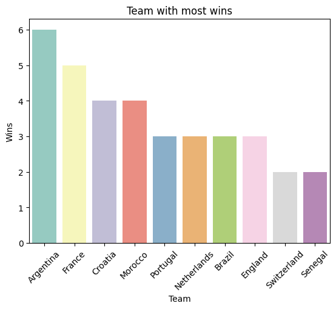
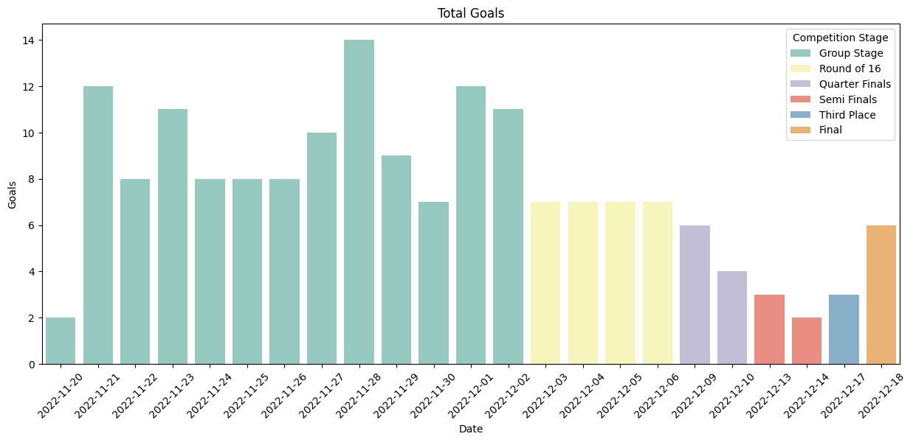
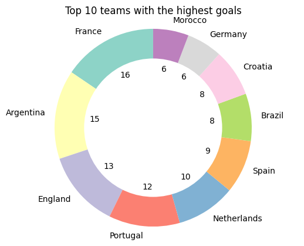
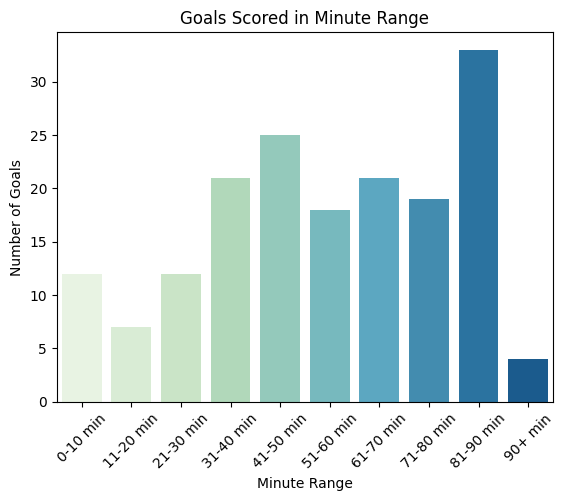
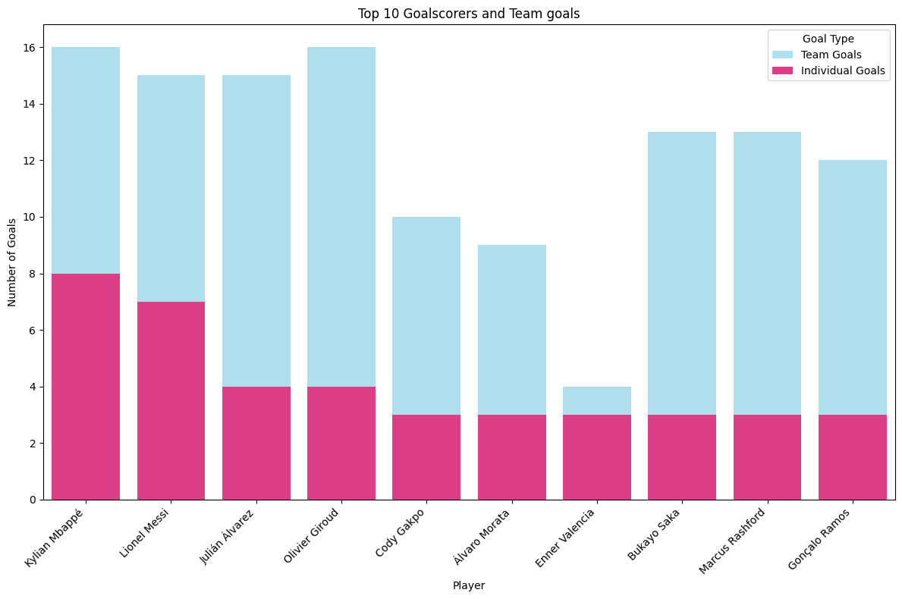

# Python FIFA Analysis


### Project Overview

Data analysis on 2022 FIFA World Cup using python3. The aim is to analyse the data to find the performance of the tournament by looking into high performance team and players.

### Data sources

International Football dataset: Consist of three csv. file data "results.csv", "goalscorers.csv", and "shootouts.csv"

### Tools

- Python - Data cleaning,Data preparation, EDA, and Data visualisation
	- Pandas
	- Numpy
	- Matplotlib.pylab
	- Seaborn
-Jupyter Notebook - Reporting environment

### Data Cleaning and Preparation

1. Importing essential libraries 

```Python

import pandas as pd
import numpy as np
import matplotlib.pylab as plt
import seaborn as sns
from datetime import datetime

```

2. Import All three file using pandas

```Python

result = pd.read_csv('C:\\Users\\Kaggle\\results.csv')
scorers = pd.read_csv('C:\\Users\\Kaggle\\goalscorers.csv')
penalty = pd.read_csv('C:\\Users\\Kaggle\\shootouts.csv')

```

3. Converting date format

```Python

result['date'] = pd.to_datetime(result['date'], format='%Y-%m-%d')

```

4. Checking for null values


```Python

result.isna().sum()

```

```Python

result[result.isna().any(axis=1)]

```


### Data Tranformation

1. Filtering only for 2022 FIFA world cup

```Python

result["tournament"].unique()

```

```Python

result = result.loc[result["tournament"] == "FIFA World Cup"]

```


```Python

result = result.loc[result["year"] == 2022]

```

2. Adding new column of Total Goals from home_score and away_score

```Python

result["total_goals"] = result["home_score"] + result["away_score"]

```

3. Adding new winner column based on the match results.

```Python

result["winner_fulltime"] = None

result.loc[result["home_score"] > result["away_score"], "winner_fulltime"] = result["home_team"]
result.loc[result["home_score"] < result["away_score"], "winner_fulltime"] = result["away_team"]
result.loc[result["home_score"] == result["away_score"], "winner_fulltime"] = "Tie"

```


### All 3 dataset undergoes the same process of data cleaning and preparation such as:

- Date conversion
- Data filtering
- Adressing NA values


1. Merging penalty and results table into one to get the winners for each game

```Python

results = pd.merge(result, penalty, on= ["date","home_team","away_team"], how= "left" )

```
- Looking from the results table that the game is tied while referring to the winner at penalty table

```Python

results.loc[results["winner_fulltime"] == "Tie"]

```
- Replacing the tie result in results table to the actual winner after penalties

```Python

results["winner_fulltime"]= results["winner"].where(results["winner"].notna(), results["winner_fulltime"])

```
- Dropping the winner column from penalty and left with winner at fulltime

```Python

results= results.drop(columns= "winner")

```


### Data Exploration

1. Looking at table structure


```Python

results.info()

```

2. Finding the team that wins the most games in histogram visuals

```Python

filtered_result = results[results["winner_fulltime"] != "Tie"]

team_counts = filtered_result["winner_fulltime"].value_counts(ascending=False).head(10)

sns.barplot(x=team_counts.index, y=team_counts.values, hue=team_counts.index, palette='Set3', dodge=False)
plt.xlabel('Team')
plt.ylabel('Wins')
plt.title('Team with most wins')

plt.xticks(rotation=45)

plt.show()

```


3. Finding the total goals scored across the competition on each stage in histogram visuals

```Python

results['date'] = pd.to_datetime(results['date'])
results = results.sort_values('date')

partitions = {
    (pd.Timestamp('2022-11-20'), pd.Timestamp('2022-12-02')): 'Group Stage',
    (pd.Timestamp('2022-12-03'), pd.Timestamp('2022-12-06')): 'Round of 16',
    (pd.Timestamp('2022-12-09'), pd.Timestamp('2022-12-10')): 'Quarter Finals',
    (pd.Timestamp('2022-12-13'), pd.Timestamp('2022-12-14')): 'Semi Finals',
    (pd.Timestamp('2022-12-17'), pd.Timestamp('2022-12-17')): 'Third Place',
    (pd.Timestamp('2022-12-18'), pd.Timestamp('2022-12-18')): 'Final',
}

```

```Python

results['competition_stage'] = results['date'].apply(
    lambda date: next((stage for (start, end), stage in partitions.items() if start <= date <= end), None)
)

goal_date = results.groupby(['date', 'competition_stage']).agg({
    "total_goals": "sum",
    "home_score": "sum",
    "away_score": "sum"
}).reset_index()

```


```Python

order = ['Group Stage', 'Round of 16', 'Quarter Finals', 'Semi Finals', 'Third Place', 'Final']

plt.figure(figsize=(15, 6))

sns.barplot(x='date', y='total_goals', data=goal_date, hue='competition_stage', hue_order=order, palette="Set3")

plt.xlabel('Date')
plt.ylabel('Goals')
plt.title('Total Goals')

plt.xticks(rotation=45)
plt.legend(title='Competition Stage')

plt.show()

```



4. Making a pie chart of the top 10 team with the highest goals

```Python

pie_teamscore = scorers["team"].value_counts().head(10)

cmap = plt.get_cmap("Set3")
colors = cmap(range(len(pie_teamscore)))

plt.pie(pie_teamscore, labels=pie_teamscore.index, autopct='%1.0f', startangle=90, colors=colors)

centre_circle = plt.Circle((0,0),0.70,fc='white')
fig = plt.gcf()
fig.gca().add_artist(centre_circle)

plt.axis('equal')

plt.title("Top 10 teams with the highest goals")

plt.show()

```



5. Making a histogram consist of goals scored in minute range

```Python

scorers["minute_range"] = pd.cut(
    scorers["minute"],
    bins=[0, 10, 20, 30, 40, 50, 60, 70, 80, 90, float('inf')],
    labels=["0-10 min", "11-20 min", "21-30 min", "31-40 min", "41-50 min", "51-60 min", "61-70 min", "71-80 min", "81-90 min", "90+ min"]
)


sns.countplot(x="minute_range", data=scorers, hue= "minute_range", palette= "GnBu")

plt.xlabel('Minute Range')
plt.ylabel('Number of Goals')
plt.title('Goals Scored in Minute Range')

plt.xticks(rotation=45)

plt.show()

```


6. Finding the top goalscorers for each team in bar plot

```Python

Top10 = scorers["scorer"].value_counts().head(10)
TeamGoals = scorers["team"].value_counts()

combined = pd.DataFrame({
    "Player": Top10.index,
    "Individual Goals": Top10.values,
    "Team": scorers.groupby("scorer")["team"].unique()[Top10.index],
    "Team Goals": scorers.groupby("scorer")["team"].apply(lambda x: TeamGoals[x.iloc[0]] if len(x) > 0 and x.iloc[0] in TeamGoals.index else 0)[Top10.index]
})

```

```Python

plt.figure(figsize=(12, 8))

sns.barplot(x='Player', y='Team Goals', data=combined, color='#4CC9F0', label='Team Goals', alpha =0.5)
sns.barplot(x='Player', y='Individual Goals', data=combined, color='#F72585', label='Individual Goals')


plt.xlabel('Player')
plt.ylabel('Number of Goals')
plt.title('Top 10 Goalscorers and Team goals')

plt.legend(title='Goal Type')
plt.xticks(rotation=45, ha="right")
plt.tight_layout()

plt.show()

```



### Results

- Argentina as expected is the team with the most win as they won the tournament followed by france in second place
- During group stages, high number of goals are scored because there are just more number of games played
- Final round was the most exciting game as there are a total of 6 goals scored compared to the semi and quater final which have less than 4 goals scored
- France top the highest goal scoring team despite coming in 2nd place
- England despite winning only 5 matches scored 13 goals which is 3rd overall in the competition
- Goals are scored the most when approaching the end of each half time at 25 goals  in  41-50 min range wjile 30+ goals in 81-90 mins showing that the team pushed harder at the end
- Kylian Mbappe is the top goalscorer in the competition followed by Lionel Messi at 8 goals and 7 goals respectively

### Limitations

- No further data on Player statistics such as Number of passes, Asssist and clean sheet to further analyze the player performances
- Lack of team data such as shots on target, possesions to make an extesive analysis to find which team perform better on average
- No record on if player play for every match to get the average goal per game


### References

1. [Kaggle](https://www.kaggle.com/datasets/martj42/international-football-results-from-1872-to-2017)
